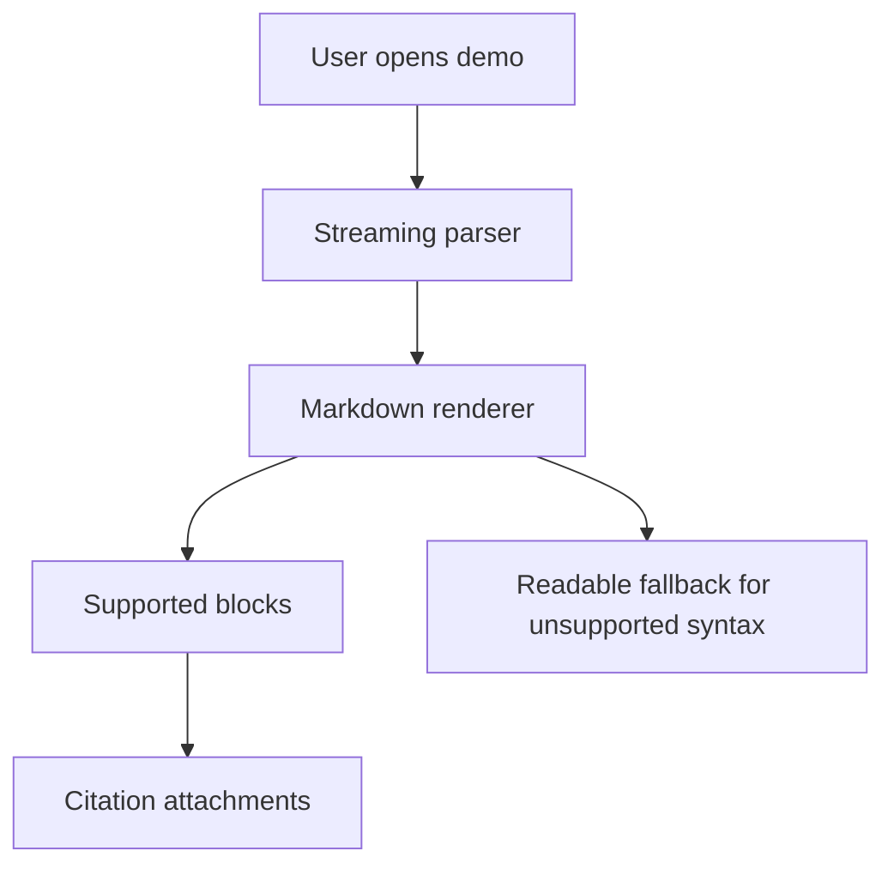

# Kitchen Sink Markdown Demonstration

This fixture intentionally mixes supported Markdown, streaming edge cases, citations, and syntax that may not have first-class rendering yet. It is useful for checking graceful fallback behavior while text is still arriving.

Inline styles: **strong text**, *emphasis*, ***strong emphasis***, ~~strikethrough~~, `inline code`, a [regular link](https://example.com), and inline math \(E = mc^2\).

Inline citations should render as compact attachments when the renderer recognizes the citation marker: [9F742443](https://example.com/release-notes?citationMarker=9F742443&citationTitle=Release%20Notes&citationA11yValue=Streaming%20Markdown%20release%20notes&citationId=doc-1&chatItemId=demo-1) [9F742443](https://example.com/api-reference?citationMarker=9F742443&citationTitle=API%20Reference&citationA11yValue=Markdown%20renderer%20API%20reference&citationId=doc-2&chatItemId=demo-1).

---

## Headings

# Heading 1
## Heading 2
### Heading 3
#### Heading 4
##### Heading 5
###### Heading 6

## Paragraphs, line breaks, and quotes

A paragraph can include a soft
line break and continue with more text.  
A hard line break follows two trailing spaces.

> Block quotes can contain **bold text**, links, citations [9F742443](https://example.com/quote-source?citationMarker=9F742443&citationTitle=3&citationA11yValue=Quoted%20source%20metadata&citationId=doc-3&chatItemId=demo-1), and nested content.
>
> - Quoted unordered item
> - Another quoted item with `code`

## Lists

- Unordered list item
- Item with nested detail:
  - Nested item A
  - Nested item B
- Item with mixed inline styles: **bold**, *italic*, and `code`

1. Ordered list item
2. Item with a continuation paragraph.

   The continuation paragraph should stay visually associated with item 2.
3. Final ordered item

- [x] Task lists are included as GitHub-flavored Markdown.
- [ ] Unchecked tasks render with an empty checkbox.

### Deep mixed nested list stress test

The next list intentionally mixes tight lists, loose lists, ordered lists, unordered lists, task lists, block quotes, code blocks, math, tables, citations, and lazy continuation lines.

1. **Discovery phase** starts as an ordered item with a paragraph continuation.

   The continuation includes inline citation [9F742443](https://example.com/nested-discovery?citationMarker=9F742443&citationTitle=Nested%20Discovery&citationA11yValue=Nested%20list%20discovery%20citation&citationId=doc-6&chatItemId=demo-1), inline math \(p95 < 200ms\), and `inline code`.

   - A nested unordered item with its own children.
     1. Ordered grandchild that starts at one.
     2. Ordered grandchild with a block quote:

        > A quote inside an ordered grandchild.
        >
        > - Quoted bullet A
        > - Quoted bullet B with **bold** and *italic*

     3. Ordered grandchild with a fenced code block:

        ```swift
        let nested = ["lists", "quotes", "code"]
        print(nested.joined(separator: " + "))
        ```

   - A sibling nested item with a task list below it.
     - [x] Completed task with a citation [9F742443](https://example.com/task-done?citationMarker=9F742443&citationTitle=7&citationA11yValue=Completed%20nested%20task%20citation&citationId=doc-7&chatItemId=demo-1)
     - [ ] Incomplete task with `code`
       - Follow-up detail under an incomplete task.
       - Another detail with a [link](https://example.com/nested-task-link).

2. **Implementation phase** uses a loose list item with a table nested under it.

   | Nested item | Markdown inside cell | Expected observation |
   | --- | --- | --- |
   | Cell link | [Docs](https://example.com/docs) | Link styling if table inline parsing is supported |
   | Cell citation | [9F742443](https://example.com/nested-table?citationMarker=9F742443&citationTitle=8&citationA11yValue=Nested%20table%20citation&citationId=doc-8&chatItemId=demo-1) | Citation attachment if table cells support attachments |
   | Cell code | `Result<T, Error>` | Inline code styling in a table |

   9. Ordered sublist deliberately starts at nine.
   10. Next item should preserve numbering intent if supported.
       1. Great-grandchild item.
          - Mixed marker under ordered list.
            1. Another ordered level.
               - Fifth-level unordered item with a very long line that should wrap cleanly without losing indentation or clipping the bullet marker in the rendered view.

3. **Review phase** demonstrates ambiguous and tricky list boundaries.
Lazy continuation line without indentation after the item marker. Some Markdown parsers attach it to item 3; others treat it as a new paragraph.

   - Bullet after a lazy continuation.

     Paragraph inside the bullet separated by a blank line.

     > Block quote inside that bullet.

        Four-space indented code-like line inside the same bullet.

   - Bullet containing thematic-break-looking text:

     ---

     The line above may be treated as a nested thematic break, not as list text.

4. **Release phase** ends with nested HTML and extension syntax.

   <aside>
   HTML inside a list is included to check whether it is preserved, ignored, or displayed as text.
   </aside>

   !!! note "Admonition inside a list"
       Python-Markdown admonitions are not standard CommonMark. They should remain readable if unsupported.

### Popular extension compatibility sampler

| Extension or tricky case | Markdown sample | What this demo is checking |
| --- | --- | --- |
| Autolink | https://example.com/autolink | Whether bare URLs become links |
| Email autolink | <demo@example.com> | Whether email autolinks are parsed |
| Emoji shortcode | :sparkles: :warning: | Whether emoji shortcodes are transformed or left as text |
| GitHub mention | @octocat | Whether mentions remain plain text |
| GitHub issue ref | #123 | Whether issue refs remain plain text |
| Highlight | ==highlighted text== | Whether mark/highlight syntax is supported |
| Superscript | x^2^ | Whether Pandoc-style superscript is supported |
| Subscript | H~2~O | Whether Pandoc-style subscript is supported |
| Insert/delete | ++inserted++ and ~~deleted~~ | Whether extension insert syntax is ignored while strikethrough works |
| Keyboard | Press <kbd>Command</kbd> + <kbd>K</kbd> | Whether inline HTML is preserved |
| Attributes | [link](https://example.com){: .button } | Whether attribute-list syntax is ignored safely |
| Wiki link | [[Internal Page]] | Whether wiki links remain readable |
| Obsidian embed | ![[diagram.png]] | Whether Obsidian embeds remain readable |
| Markdoc tag | Text | Whether templating syntax remains readable |
| MDX JSX | <Alert severity="info">MDX content</Alert> | Whether JSX-like tags remain readable |
| Escaped pipe | `a &#124; b` | Whether literal pipe-like content stays readable in table cells |

::: warning
Container directives from Markdown-it and GitHub-style alerts are extension syntax. This block should stay readable if no custom directive renderer exists.
:::

> [!NOTE]
> GitHub alert syntax is included as another block quote extension. Unsupported renderers should display it as quoted text.

> [!WARNING]
> Alerts with multiple paragraphs should still wrap and stream without corrupting following content.
>
> - Alert bullet one
> - Alert bullet two

## Code

```swift
import SwiftStreamingMarkdown
import SwiftUI

struct PreviewRow: View {
  let markdown: String

  var body: some View {
    MarkdownView(text: markdown)
      .padding(.horizontal, 16)
  }
}
```

```json
{
  "feature": "syntax-highlighted code blocks",
  "status": "supported when the renderer recognizes the language"
}
```

## Tables

| Feature | Example | Expected behavior |
| :--- | :--- | ---: |
| Inline citation | [9F742443](https://example.com/table-source?citationMarker=9F742443&citationTitle=4&citationA11yValue=Table%20source%20citation&citationId=doc-4&chatItemId=demo-1) | Render a compact citation attachment |
| Inline code | `let value = 42` | Preserve code styling in a cell |
| Link | [Example](https://example.com/table-link) | Render as tappable link |
| Alignment | 12345 | Right-align this expected-behavior column |

## Math

Inline math appears in a sentence as \(a^2 + b^2 = c^2\).

$$
\int_0^1 x^2 dx = \frac{1}{3}
$$

```latex
\frac{d}{dx} e^x = e^x
```

## Images and HTML fallback

Bundled SVG asset:


Remote(trusted) markdown:


Remote unsupported image fallback:


<details>
<summary>HTML details block</summary>

HTML blocks may render as plain text or be ignored depending on parser support.

</details>

## Mermaid diagram fallback

Mermaid is intentionally included as an unimplemented markdown feature. Until a diagram renderer exists, this should remain readable as a fenced code block.



## Footnotes and definitions fallback

Here is a footnote reference.[^streaming]

[^streaming]: Footnote syntax is included to check how unsupported block extensions degrade.

Term
: Definition list syntax is included as another compatibility check.

## Mixed final paragraph

The final paragraph combines inline math \(f(x) = x^2\), a citation [9F742443](https://example.com/final-source?citationMarker=9F742443&citationTitle=5&citationA11yValue=Final%20paragraph%20citation&citationId=doc-5&chatItemId=demo-1), and `inline code` to exercise wrapping near the end of a stream.
