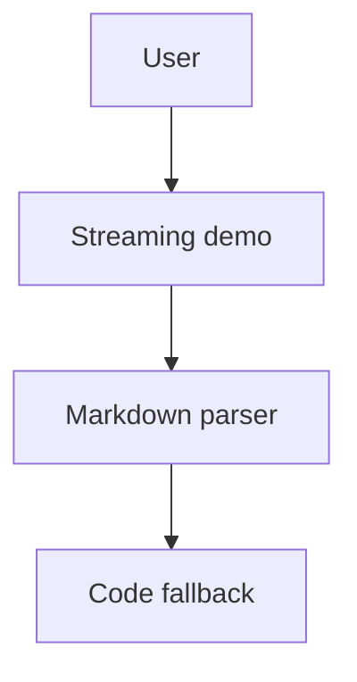

# Limitations showcase

This fixture intentionally includes content the demo renders as a fallback so limitations are visible during streaming.

## Raw HTML

The HTML block below is safe sample markup. The iOS demo currently displays the raw markup as text so fallback behavior remains visible.

<aside>
  <strong>Raw HTML callout.</strong>
  <em>Some platforms may render these tags; others show the source.</em>
</aside>

After the HTML block, normal markdown should resume with **strong text**, a [regular link](https://example.com/html-limit), and citation[^limitations-sample].

## Mermaid diagram

Mermaid is not diagram-rendered by the core renderer today. The fenced block should remain readable as code until a host app wires a Mermaid renderer.

The paragraph after the Mermaid block verifies that rendering leaves the code fallback and continues with ordinary prose.

[^limitations-sample]: Limitations showcase source
